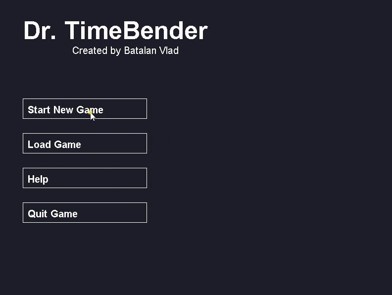

# Dr. TimeBender
Dr. TimeBender is a puzzle type game in which the main mechanic is teleporting into the past. This way, the old instancens of the main character can open various gates for the present one to proceed. Be wary though! There are many ways for the past selfs to get stuck and cause a **GRANDPA PARADOX**.

You can find the link to the gameplay here: https://www.youtube.com/watch?v=KVL3RTZMS3U
(The video is made for an older version of the game. The current one contains optimisations for the lag due to render.)

Preview of the game:

